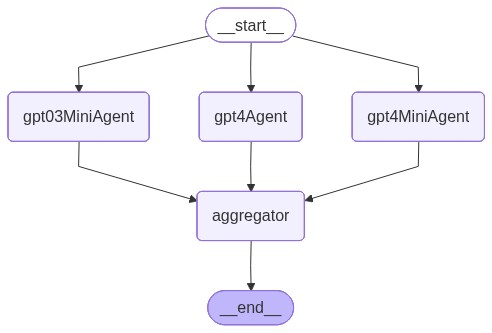
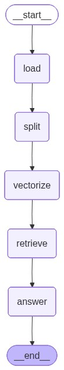
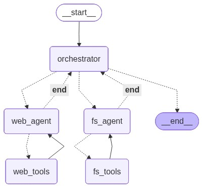
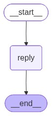

# LangGraph — quick tour and demo highlights

## What is LangGraph

- Lightweight, open-source framework for building LLM apps as graphs (nodes = steps/agents/tools, edges = control flow).
- Emphasizes deterministic orchestration, concurrency, and state via immutable checkpoints/resumability.
- Ideal for multi-step workflows, multi-agent systems, parallelism, retries, and safe rollbacks.

## LangGraph vs. LangChain

- Paradigm: LangGraph is a stateful graph; LangChain focuses on composable chains/agents.
- Control flow: LangGraph offers explicit branching, routing, and cycles; LangChain tends to be sequential unless you add control logic.
- Concurrency: LangGraph supports native fan-out/fan-in; LangChain is typically serial unless managed externally.
- State & persistence: LangGraph uses immutable state and checkpoints; LangChain uses memories/stores without graph-wide snapshots.
- Multi-agent: LangGraph models agents as nodes/subgraphs with explicit message passing; LangChain agents are powerful but less graph-explicit.
- Use both: Orchestrate with LangGraph; leverage LangChain for model IO, tools, retrievers, and prompt utilities.

## Keep in mind

- Graphs add small upfront design cost; payoff is clarity, reliability, and testability.
- LangGraph and LangChain are complementary: use LangGraph for orchestration and LangChain’s ecosystem for models, prompts, retrievers, and tools.

## Repo demos

### 1) Fan-in/Fan-out orchestration (Demo 1)

- Runs three models in parallel (fan-out), then aggregates and selects the best response (fan-in).
- Demonstrates parallelism, routing, and deterministic aggregation.

### 2) RAG with file upload (Demo 2)

- User uploads a text file to augment the model’s context.
- Content is vectorized; queries retrieve relevant chunks for grounded answers.
- Shows retrieval-augmented responses with user-provided knowledge.

### 3) Agentic system with MCP (Demo 3)

- Orchestrator agent routes to:
  - Web agent using a Playwright MCP server to scrape and summarize a website.
  - File-system agent (MCP) to write a local Markdown file.
- Highlights multi-agent routing, tool isolation, and inter-agent handoff.
- [Marketplace](https://mcpmarket.com/search)

### 4) Conversation rollback (Demo 4)

- In-memory versioning of each interaction in a conversation.
- Enables undo/time travel and safe retries via LangGraph’s immutable state.
- Useful for moderation, evaluation, and debugging complex flows.

## When to reach for LangGraph

- You need explicit, auditable control flow with branches, loops, or routers.
- You want fan-out/fan-in, concurrency, or structured aggregation of multiple model calls.
- You require persistent state, checkpoints, and easy rollback for resilience.
- You’re orchestrating multiple agents/tools that must coordinate reliably.
